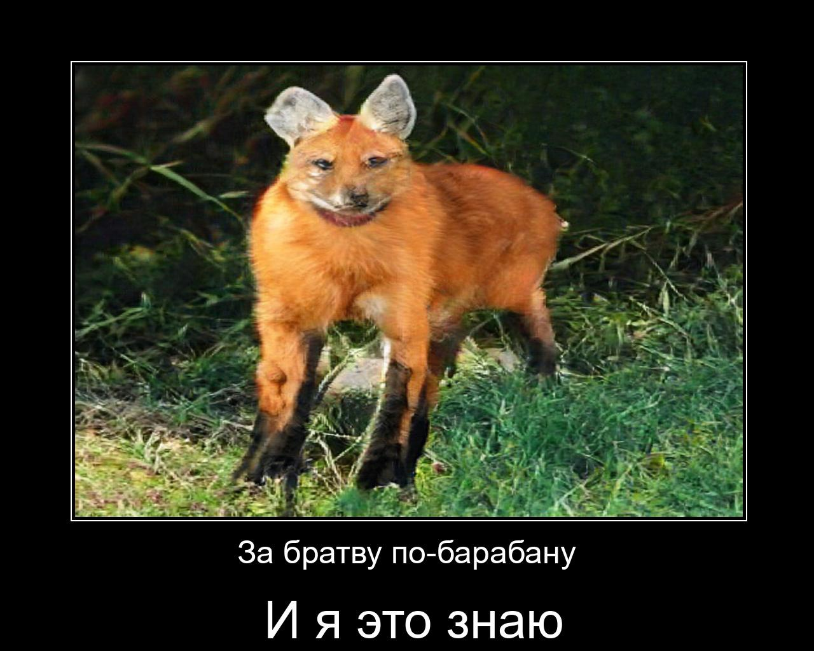

# neurowolf

Нейропацан, генерирующий демотиваторы с нейроцитатами и нейроволками  
[Колаб для интерактивного взаимодействия](https://colab.research.google.com/drive/1H4mxFDGZz6USuAv6ruDttnGaP0V26iI1?usp=sharing)  
# Принцип работы
Сначала было собрано 1070 "пацанских" цитат, на которых нафайнтюнили gpt3(основанная на gpt2) [модель](https://huggingface.co/sberbank-ai/rugpt3small_based_on_gpt2) от Сбера. Для генерации нейроволков используется API text2image [нейросети](https://deepai.org/machine-learning-model/text2img) от DeepAI, а для создания демотиваторов - библиотека [simpledemotivators](https://github.com/Infqq/simpledemotivators).  
После генерации NLP моделью текста он обрезается до двух отдельных предложений и подается на вход библиотеке для демотиваторов вместе с полученной по api картинкой.  
Для генерации цитаты используется либо "затравка" из списка заранее заготовленных, либо введенная пользователем. Пользователь также может изменить запрос для генерации картинки с помощью параметра <code>picture_target</code>(функции create_picture)
